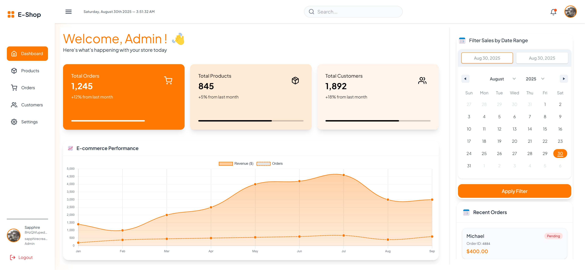

<!-- Banner -->
<h1 align="center">🛒 E-Commerce Admin Dashboard</h1>

  A modern, responsive, and interactive Admin Dashboard for managing your e-commerce business. 
  Built with <b>React, Vite, TailwindCSS, Redux, Firebase, and Framer Motion</b>. 
  Inspired by <a href="https://www.bumpa.com/" target="_blank">BUMPA</a>.

---

## 📑 Table of Contents
- [✨ Features](#-features)
- [🛠️ Tech Stack](#️-tech-stack)
- [📸 Screenshots](#-screenshots)
- [⚡ Getting Started](#-getting-started)
- [🔐 Authentication](#-authentication)
- [🌐 API with JSON-Server](#-api-with-json-server)
- [🚀 Deployment](#-deployment)
- [🤝 Contributing](#-contributing)
- [📜 Note](#-note)
- [👨‍💻 Author](#-author)

---

## ✨ Features

- **Dashboard Homepage**
  - Line chart data visualization  
  - Overview cards with real-time data  

- **Products Page**
  - Add, edit, and delete products  

- **Orders Page**
  - Add/edit orders  
  - Select products from existing catalog  

- **Customers Page**
  - View customer information  

- **Profile Page**
  - View and edit admin profile details  

---

## 🛠️ Tech Stack

## 🛠️ Tech Stack

---

## 📸 Screenshots
> 

  

---

## 🌐 API with JSON-Server

Since I'm a frontend developer and I needed to work with endpoints to make my project more meaningful and scalable, I created a JSON-Server to simulate backend data for products, orders, and customers. 
I hosted on Render for persistence.

Provides RESTful endpoints like:

  - GET    /products
  - POST   /products
  - PUT    /products/:id
  - DELETE /products/:id

LIVE URL
https://ecommerce-admin-dashboard-u0nq.onrender.com

## 🚀 Deployment

  - Frontend deployed with Vercel

  - API (JSON-Server) hosted on Render

Live Demo: 👉 [View Project](https://ecommerce-admin-dashboard-sage-gamma.vercel.app)

## 🤝 Contributing

Contributions, issues, and feature requests are welcome!
Feel free to fork this repo and submit a pull request.

## 📜 NOTE

This project was built with intentionality: not just to show coding skills, but to demonstrate the ability to create a real-world, scalable application.

Planned improvements:
  - Google Authentication
  - Exportable/downloadable customer data
  - Continuous feature iteration

Through this project, I enhanced my skills in:
  - CRUD operations
  - Data fetching and handling
  -  Writing clean, maintainable code

## 👨‍💻 Author

Built with ❤️ by Igboayaka Johnpeter Izuchukwu
